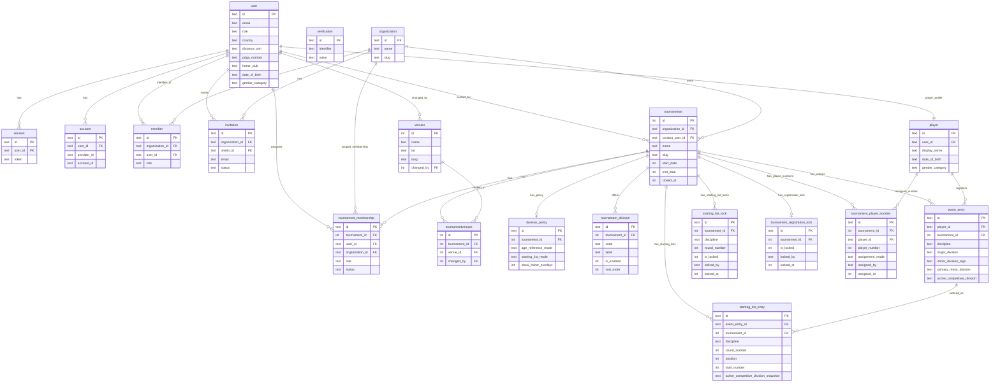

# Database ER Diagram

This diagram reflects the current schema relationships in the project (including divisions, entries, starting-list locks, and tournament registration lock).

Maintenance rule: whenever a DB schema table/relation changes in `lib/db/schema/*`, update this ER diagram in the same PR.

